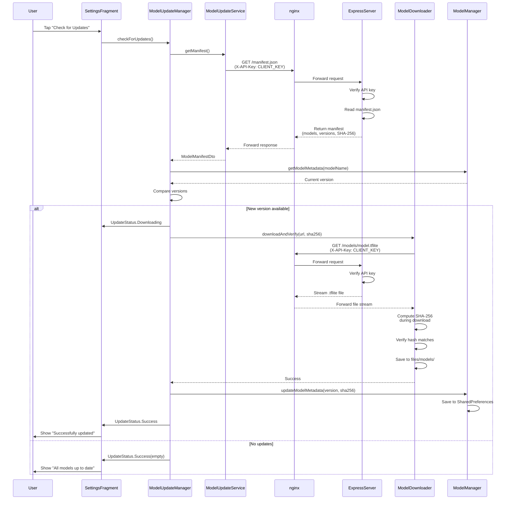

# FreshFood 🍎

**An Android app for food quality analysis using TensorFlow Lite models with over-the-air (OTA) update capabilities**


## Overview

FreshFood is a mobile application that leverages machine learning to help users determine the quality and freshness of their food. The app uses TensorFlow Lite models for real-time food scanning and classification, with a sophisticated over-the-air (OTA) update system that allows seamless model updates without requiring APK reinstallation.

### Key Features

- 📸 **Real-time Food Scanning** - Capture images via camera or select from gallery
- 🤖 **ML-Powered Freshness Detection** - Classify food as Fresh, Ripe, Overripe, or Spoiled
- 🔄 **OTA Model Updates** - Seamless model updates without app reinstallation
- 🔒 **SHA-256 Integrity Verification** - Ensures model authenticity and security
- 🔑 **API Key Authentication** - Two-tier security system (admin/client keys)
- 📊 **Contribution System** - Submit training data to improve models
- 📚 **Scan History** - Track all scans with Room database persistence

## Architecture

### System Overview

FreshFood consists of two main components: an Android app (client) and a Node.js/Express server (backend) with nginx as a reverse proxy.



### Component Breakdown

**Android App**
- **UI Layer** - Activities, Fragments (MainActivity, SettingsFragment, ScanFragment, HistoryFragment)
- **ML Inference** - TensorFlow Lite model loading and inference (ModelManager, ClassifierHelper)
- **OTA Client** - Model update orchestration (ModelUpdateManager, ModelDownloader, ModelUpdateService)
- **Data Layer** - Room database for scan history, SharedPreferences for model metadata
- **Network Layer** - Retrofit/OkHttp with API key authentication (ApiKeyInterceptor)

**Server Infrastructure**
- **Express API** - RESTful endpoints for manifest, model downloads, and admin uploads
- **Model Storage** - File system storage with SHA-256 hashing
- **Manifest Management** - JSON-based model metadata with version tracking
- **Authentication** - Two-tier API key system (admin/client) with timing-safe comparison
- **Rate Limiting** - Per-API-key (50 req/15min) and per-IP (100 req/15min) limits

**nginx Reverse Proxy**
- **SSL/TLS Termination** - HTTPS with Let's Encrypt certificates
- **Security Headers** - HSTS, CSP, X-Frame-Options, X-Content-Type-Options
- **Rate Limiting** - 10 req/s with burst capacity
- **Header Forwarding** - X-API-Key passthrough for authentication

## Quick Start

### Prerequisites

- **Android Development**: Android Studio Hedgehog+ (2023.1.1+), JDK 17+
- **Server**: Node.js 18.x+, npm 9+
- **Production**: nginx 1.18+, Ubuntu 22.04+ (recommended)

### Clone Repository

```bash
git clone https://github.com/JodyPutra-dev/FreshFood.git
cd FreshFood
```

### Server Setup

```bash
# Navigate to server directory
cd server

# Install dependencies
npm install

# Configure environment
cp .env.example .env
nano .env  # Edit configuration (set API keys, port, etc.)

# Generate API keys
openssl rand -hex 32  # For ADMIN_API_KEY
openssl rand -hex 32  # For CLIENT_API_KEY

# Start development server
npm run dev

# Or start with PM2 (production)
pm2 start src/index.js --name freshfood-server
```

Server will start at `http://localhost:3000` by default.

### Android Setup

1. Open project in Android Studio
2. Create `local.properties` in project root (if not exists):
   ```properties
   sdk.dir=C\:\\Users\\YourUser\\AppData\\Local\\Android\\Sdk
   
   # Server configuration (for local testing)
   modelUpdateBaseUrl=http://10.0.2.2:3000/models/
   modelUpdateApiKey=your-client-api-key-here
   contributeBaseUrl=http://10.0.2.2:3000/api/
   ```
3. Sync Gradle: `File > Sync Project with Gradle Files`
4. Build project: `Build > Rebuild Project`
5. Run on emulator or device: `Run > Run 'app'`

**Note**: `10.0.2.2` is the Android emulator's alias for `localhost`. For physical devices on the same network, use your computer's IP address (e.g., `http://192.168.1.100:3000/models/`).

For detailed setup instructions, see:
- **Server Setup**: [server/README.md](server/README.md)
- **Deployment Guide**: [docs/DEPLOYMENT.md](docs/DEPLOYMENT.md)

## Project Structure

```
FreshFood/
├── app/                          # Android application
│   ├── src/main/
│   │   ├── java/com/jody/freshfood/
│   │   │   ├── ui/               # Activities and Fragments
│   │   │   ├── ml/               # ML inference and OTA updates
│   │   │   ├── network/          # Retrofit services and interceptors
│   │   │   ├── data/             # Room database and repositories
│   │   │   └── utils/            # Utility classes
│   │   ├── assets/models/        # Bundled TFLite models
│   │   └── res/                  # Resources (layouts, drawables, etc.)
│   └── build.gradle.kts          # App-level Gradle configuration
├── server/                       # Node.js/Express server
│   ├── src/
│   │   ├── routes/               # API route handlers
│   │   ├── middleware/           # Authentication, rate limiting
│   │   └── utils/                # Hashing, manifest management
│   ├── models/                   # TFLite model storage
│   ├── scripts/                  # Upload, init, verify scripts
│   ├── nginx/                    # nginx configuration
│   └── package.json              # Server dependencies
├── docs/                         # Documentation
│   ├── ANDROID_TESTING.md        # Android OTA testing guide
│   ├── TROUBLESHOOTING.md        # Common issues and solutions
│   └── DEPLOYMENT.md             # Production deployment guide
├── ML-Development/               # Machine learning pipeline
│   ├── data_preprocessor.py      # Data preprocessing
│   ├── train.py                  # Model training
│   └── README.md                 # ML pipeline documentation
└── README.md                     # This file
```

## Documentation

Comprehensive guides for all aspects of the FreshFood system:

| Document | Description |
|----------|-------------|
| [Server Setup & Deployment](server/README.md) | Complete server installation, configuration, API documentation, and troubleshooting |
| [Nginx Configuration](server/nginx/README.md) | Reverse proxy setup, SSL/TLS configuration, security headers |
| [Android Testing Guide](docs/ANDROID_TESTING.md) | OTA update testing, SHA-256 verification, network scenarios, emulator/device testing |
| [Troubleshooting Guide](docs/TROUBLESHOOTING.md) | Common issues, error codes, debugging tips for Android and server |
| [Deployment Guide](docs/DEPLOYMENT.md) | Step-by-step production deployment for server and Android app |

## Security

FreshFood implements multiple layers of security to protect model integrity and API access:

- 🔐 **Two-Tier API Key System** - Separate keys for admin operations (uploads) and client operations (downloads)
- 🔒 **HTTPS Enforcement** - All production traffic encrypted with TLS 1.2/1.3
- ✅ **SHA-256 Model Verification** - Every model download verified against cryptographic hash
- ⏱️ **Timing-Safe Comparison** - API key validation resistant to timing attacks
- 🚦 **Rate Limiting** - Multi-layer protection (per-API-key and per-IP)
- 🛡️ **Security Headers** - HSTS, CSP, X-Frame-Options, X-Content-Type-Options
- 🌐 **CORS Restrictions** - Configurable origin whitelist

For security best practices and API key management, see [server/README.md](server/README.md#security-considerations).

## Development

### Building the Android App

```bash
# Debug build (uses localhost for emulator)
./gradlew assembleDebug

# Release build (uses production URLs)
./gradlew assembleRelease

# Run tests
./gradlew test

# Run instrumented tests
./gradlew connectedAndroidTest
```

### Local Server Testing

```bash
# Start development server with hot reload
cd server
npm run dev

# Run in production mode
npm start

# Run tests (when implemented)
npm test
```

### Debug vs Release Configurations

**Debug Build**
- Server URL: `http://10.0.2.2:3000/models/` (emulator localhost)
- API Key: `debug-api-key-for-local-testing`
- Logging: Verbose HTTP logging enabled
- Minification: Disabled

**Release Build**
- Server URL: From `gradle.properties` (production domain)
- API Key: From `gradle.properties` or `local.properties`
- Logging: Minimal
- Minification: ProGuard/R8 enabled

### Testing OTA Updates

1. Start local server: `cd server && npm run dev`
2. Build and run app: `./gradlew installDebug`
3. Navigate to Settings tab in app
4. Tap "Check for Updates" button
5. Observe update status and progress

For comprehensive testing procedures, see [docs/ANDROID_TESTING.md](docs/ANDROID_TESTING.md).

## Contributing

Contributions are welcome! Here's how you can help:

1. **Fork the repository**
2. **Create a feature branch**: `git checkout -b feature/amazing-feature`
3. **Commit your changes**: `git commit -m 'Add amazing feature'`
4. **Push to branch**: `git push origin feature/amazing-feature`
5. **Open a Pull Request**

### Code Style

- **Kotlin**: Follow [Kotlin coding conventions](https://kotlinlang.org/docs/coding-conventions.html)
- **JavaScript**: Use ESLint with provided configuration
- **Formatting**: Use 4 spaces for indentation (Kotlin) and 2 spaces (JavaScript)

### Pull Request Guidelines

- Include clear description of changes
- Update documentation if needed
- Add tests for new features
- Ensure all tests pass: `./gradlew test`
- Follow existing code style

## License

This project is licensed under the MIT License - see the LICENSE file for details.

## Support

For issues, questions, or contributions:

- **Issues**: [GitHub Issues](https://github.com/JodyPutra-dev/FreshFood/issues)
- **Documentation**: See [docs/](docs/) directory
- **Troubleshooting**: [docs/TROUBLESHOOTING.md](docs/TROUBLESHOOTING.md)

---

**Built with ❤️ using Kotlin, TensorFlow Lite, and Node.js**
